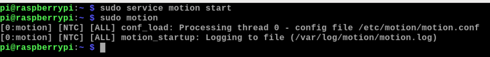
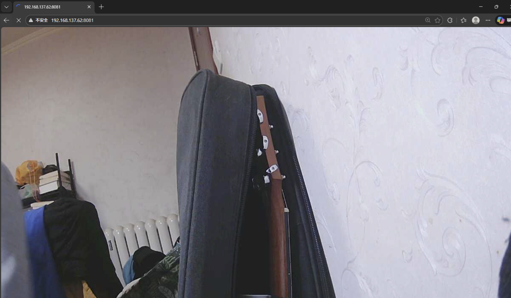

# Here's the instruction of Motion!
## 1. Update system
```
sudo apt-get update
```
```
sudo apt-get upgrade
```
## 2. Copy master.zip under the catalogue of pi

## 3. Unzip
```
unzip master.zip
```
## 4. Install cmake, used for compile
```
sudo apt-get install cmake -y
```
## 5. Install support library
```
sudo apt-get install libjpeg8-dev -y
```
## 6. Compile
```
sudo make clean all
```
## 7. Reboot system
```
sudo reboot
```
## 8. Enter system
```
cd /home/pi/mjpg-streamer-master/mjpg-streamer-experimental/
```
## 9. Enable usb camera
```
./mjpg_streamer -i "./input_uvc.so" -o "./output_http.so -w ./www" 
```
## 10. Online test, where xxx.xxx.x.xxx is the ip of camera
```
http://xxx.xxx.x.xxx:8080/?action=snapshot  
```
## 11. Using this camera will occupy the resource, it must be killed after use
```
ps a
```
```
sudo kill -9 PID
```
## 12. Enable Motion
```
sudo service motion start
```
```
sudo motion
```





