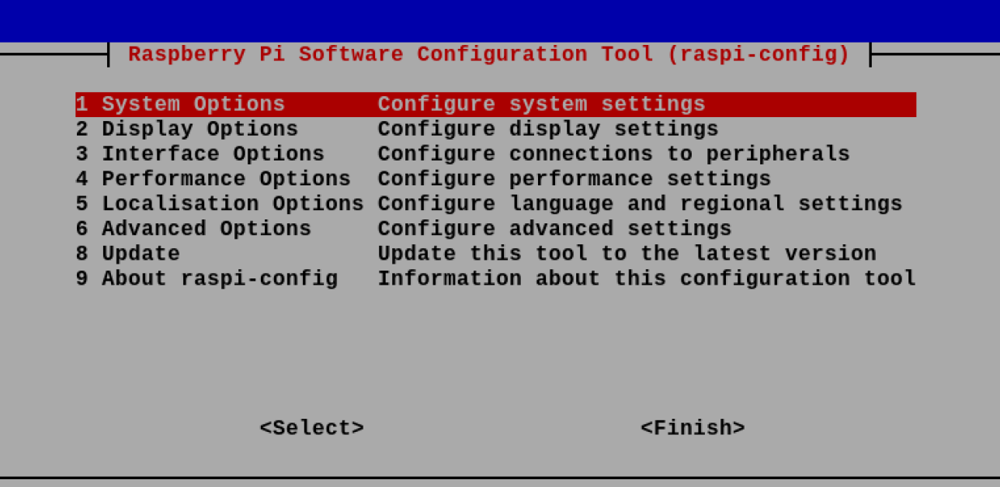
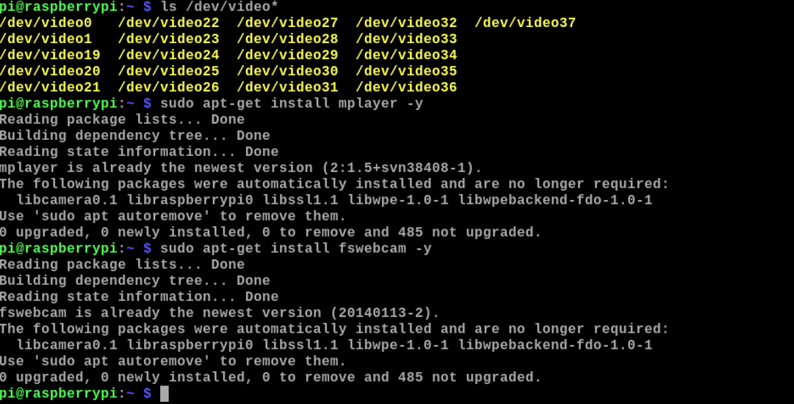
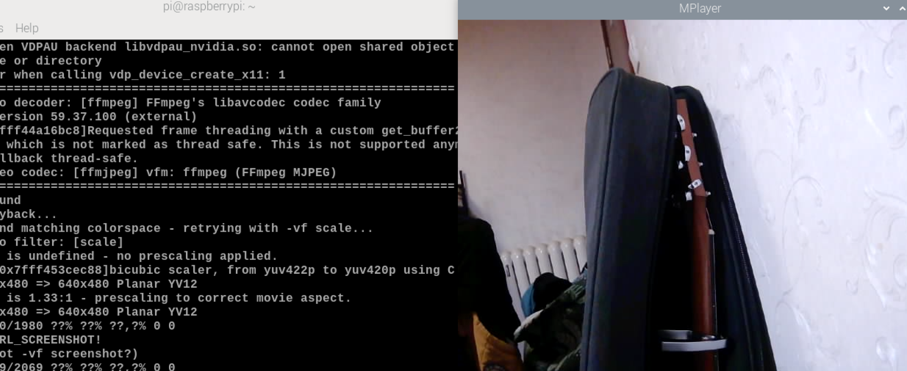

# Here's the instruction of Mplayer!

## 1. Enable camera driver
```
sudo raspi-config
```


## 2. Before turning on, make sure you connect the Usb of Raspberry with the Usb of camera!

## 3. Find external camera
```
ls /dev/video*
```
## 4. install mplayer driver
```
sudo apt-get install mplayer -y
```
## 5. install fswebcam driver
```
sudo apt-get install fswebcam -y
```


## 6. watch the video
```
sudo mplayer tv://
```


