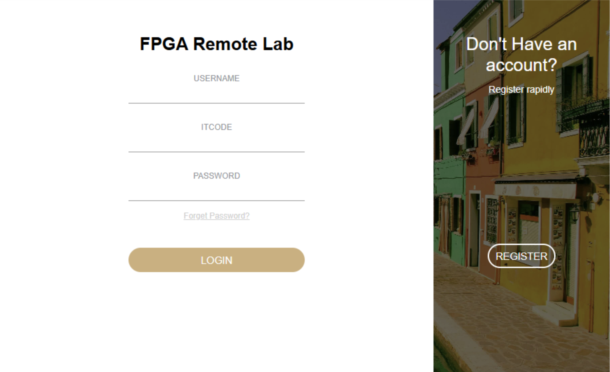

# Remote_FPGA_Lab

🎯*We built a system based on FPGA and Raspberry Pi, and we also designed a fabulous website embedded with our system.

## Our Website
We designed a colorful and portable website, click [here](./website.md) to quickly go through our website!

## Logic Analyzer

## IP Camera
We uses web camera of raspberry pi 5 to record the scenories in the lab, click [here](/IPCamera/README.md) to view our camera configuration!

